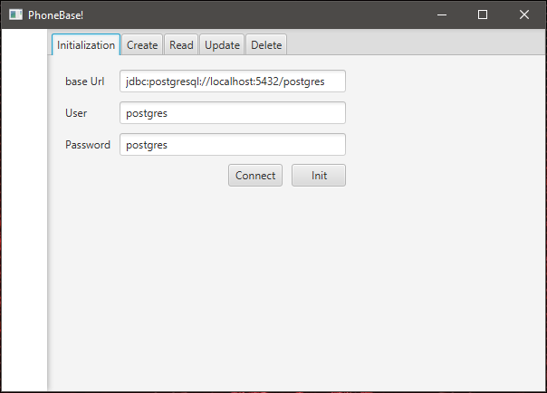
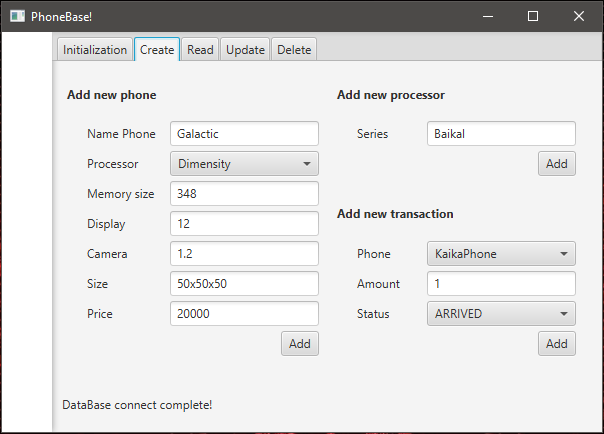
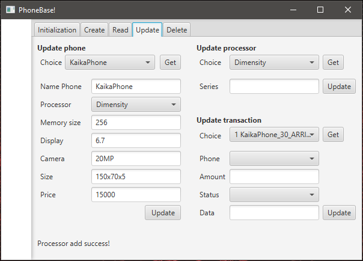
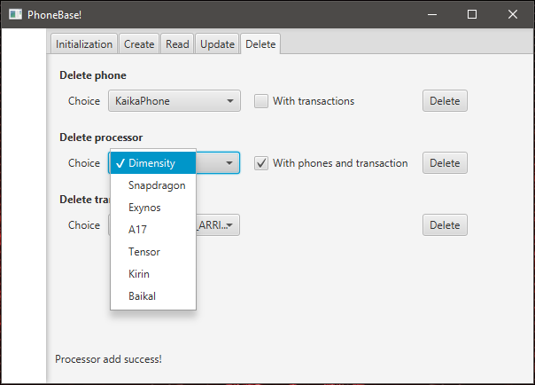

# MobilShop
Interface and business logic for working with the mobile phone store database.

Maven, PostgreSQL, REST, Hibernate

Spring Boot Starter, JavaFX, Lombok, Logger

UX/UI, DAO, Repository, Singleton, CRUD, KISS, DRY, YAGNI

## Overview

The program uses key mechanisms to work with the PostgreSQL DBMS via JDBC. Allows you to visually view, add, search, edit and delete store products, as well as their parameters.

## Installation

To start the project you will need Maven and a working Postgresql database.

    sudo apt-get install postgresql
    sudo apt install maven

Compiling and running:

    mvn clean install
    java -jar target/MobilShop-1.0-SNAPSHOT.jar

## Usage
When launched, the program displays the "Initialization" menu tab for connecting to the database. Enter your connection parameters and click "Connect". To fill the database with template values, press "Init". 

To work with data, use the remaining tabs.

## Usage without interface

To perform HTTP requests, you can use the command line tool cURL. Check that you have it installed.

    sudo apt install curl

You can also use **Insomnia**, **Postman** or other similar programs instead of the command line.

In this mode, the parameters specified in the first screenshot are used to connect to the database.

*Example of a request to get a phone by ID:*

    curl -X GET http://localhost:8080/mobilshop/phone?id=1

*Example of a request to get a processor by ID:*

    curl -X GET http://localhost:8080/mobilshop/processor?id=10

*Example of a request to get a transaction by ID:*

    curl -X GET http://localhost:8080/mobilshop/transaction?id=8

*Example of a request to add a new phone:*

    curl -X POST http://localhost:8080/mobilshop/phone/add --json "{\"name\":\"Galactic\",\"processorid\":1,\"memorysize\":348,\"display\":\"12\",\"camera\":\"21.2MP\",\"size\":\"50x50x50\",\"price\":20000}"

*Example of a request to add a new processor:*

    curl -X POST http://localhost:8080/mobilshop/processor/add --json "{\"description\":\"Baikal\"}"

*Example of a request to add a new transaction:*

    curl -X POST http://localhost:8080/mobilshop/transaction/add --json "{\"goodid\":1,\"amount\":10,\"status\":\"ARRIVED\",\"date\":\"2024-06-15T21:33:13.000\"}"

*or without 'date' to set the current time*

    curl -X POST http://localhost:8080/mobilshop/transaction/add --json "{\"goodid\":2,\"amount\":4,\"status\":\"SOLD\"}"

> You can use `-H "Content-type:application/json" -d` instead of `--json`

*Example of a request to remove a phone from the database:*

    curl -X DELETE http://localhost:8080/mobilshop/phone/14

*Example of a request to remove a processor from the database:*

    curl -X DELETE http://localhost:8080/mobilshop/processor/7

*Example of a request to remove a transaction from the database:*

    curl -X DELETE http://localhost:8080/mobilshop/transaction/15

## Remove

    rm -r target