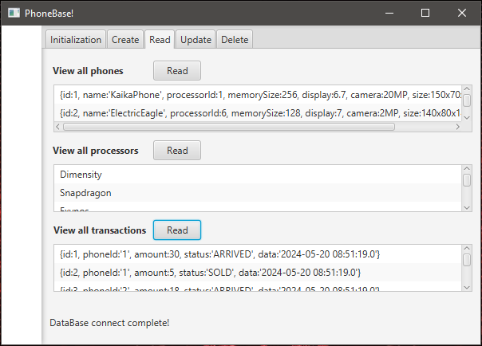

# MobilShop
Interface and business logic for working with the mobile phone store database.

Maven, PostgreSQL

Spring Boot Starter, JavaFX, Lombok, Logger, 

UX/UI, DAO, Repository, Singleton, CRUD, KISS, DRY, YAGNI

## Overview

The program uses key mechanisms to work with the PostgreSQL DBMS via JDBC. Allows you to visually view, add, search, edit and delete store products, as well as their parameters.

## Installation

To start the project you will need Maven and a working Postgresql database.

    sudo apt-get install postgresql
    sudo apt install maven

Compiling and running:

    mvn clean install
    java -jar target/MobilShop-1.0-SNAPSHOT.jar

## Usage
When launched, the program displays the "Initialization" menu tab for connecting to the database. Enter your connection parameters and click "Connect". To fill the database with template values, press "Init". 

To work with data, use the remaining tabs.

## Remove

    rm -r target